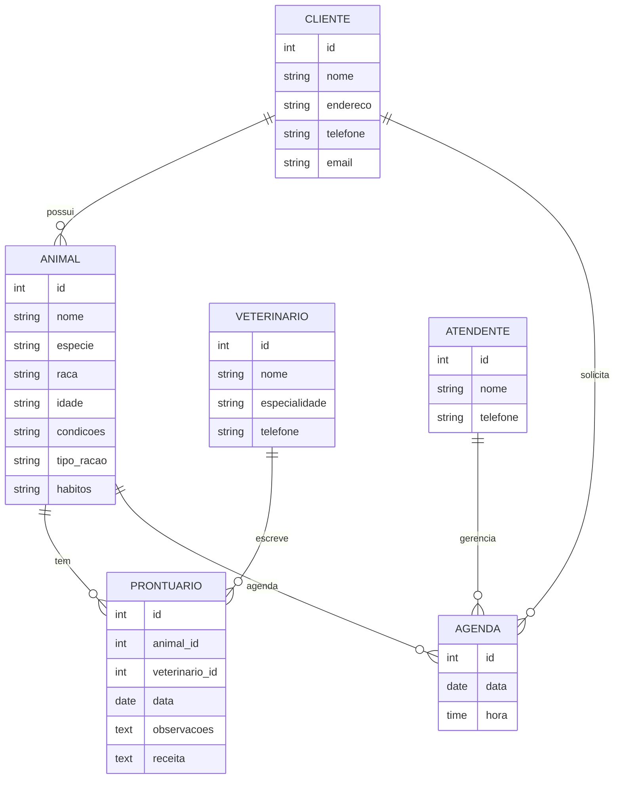
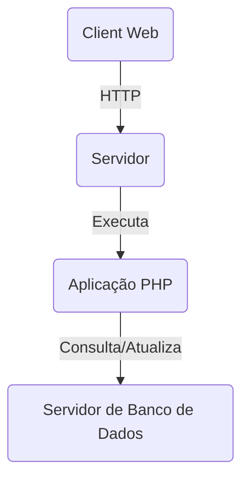

# Ruan_Silva
Aula de Engenharia de Software.  

Sistema para Cliente Veterinaria.

Autor: Ruan Conceição da Silva.   

# 1.Descrição do Sistema
1-Uma clínica veterinária atende apenas os animais: gatos e cachorros.  
2-Os clientes devem fazer um cadastro de si e dos animais.     
3-Os clientes devem informar as condições nas quais os animais chegam.   
4-Os clientes devem informar o tipo de ração que o animal come.         
5-O cliente deve informar hábitos do animal.        
6-Para cada animal é possível que mais de um veterinário o atenda.      
7-Os animais podem chegar e serem atendidos de acordo com uma agenda do dia.        
8-Cada animal atendido receberá uma ficha e um prontuário.          
9-Outros donos podem querer marcar horários de atendimento futuro.      
10-O atendimento gera uma receita para o animal.        
11-Quando um cliente chega na clínica veterinária ele é atendido por um atendente.          
12-O atendente deve verificar se existe agenda disponível com um veterinário.           
13-O atendente deve colocar o cliente e seu animal na fila de espera, se for o caso.          
14-O atendente deve levar o cliente e o animal até o veterinário.           
15-O veterinário deve realizar uma entrevista com o dono do animal.               
16-O resultado da entrevista deve ir para um formulário.            
17-O veterinário deverá examinar o animal e anotar em prontuário(ficha) suas observações.              
18-Dependendo da situação do animal este receberá uma receita.          
19-Horario de funcionamento: 07hrs:00 às 17hrs:00.                  
20-Casos de Emergência: 19hrs às 21hrs:00.  
21-Planos de Saúde para os animais.     
22- A clinica tem uma lista de produtos para cães e gato.   
23-O Atendimento será por forma de agendamento. 
24-A cada novo cliente terá blindes.    
25-Temos transporte para seus gatos e cachorro. 

# 2. Diagrama banco de dados

!{imagem} (link da imagem)

# 3. Diagrama de casos de uso

# 4. principais telas do sistema

# 5. Arquitetura do Sistema

